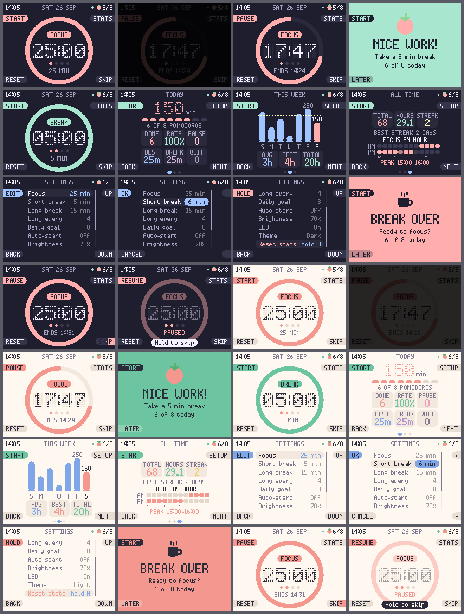

# Pastel Pomodoro

A Pomodoro timer for the **Raspberry Pi Pico W** with the **Pimoroni Pico Display 2.0** (320x240 IPS). It has pastel colours, a dot-matrix clock face, and statistics that are kept on the Pico.



## Features
- Focus, short break and long break phases. There is a long break after every N focus sessions.
- A progress ring that shrinks clockwise, the finish time ("ENDS 14:31"), and dots that show where you are in the cycle.
- A full-screen card when a phase ends. The RGB LED breathes and the backlight pulses. Auto-start is optional.
- Statistics:
  - **Today**: focus minutes, progress towards your daily goal, completion rate, pauses, longest focus without a pause, break minutes, and abandoned sessions.
  - **This week**: a 7-day bar chart with a goal line, plus average, best day and total.
  - **All time**: total pomodoros and focus hours, your current and best goal streak (in days), and a heatmap of focus time by hour with your peak hour.
- Settings for durations, daily goal, auto-start, brightness, LED, and a dark or light theme. You can also reset the stats by holding a button.
- The screen dims after 60 s without a button press. The first press only wakes it up and does nothing else.
- WiFi is used only to set the clock over NTP, and it is switched off again afterwards.

## Buttons
The rounded tabs at the screen edges always show what the button next to them does. A tab that fills up while you hold the button means that action needs a long press.

| Screen | A (top-left) | B (bottom-left) | X (top-right) | Y (bottom-right) |
|---|---|---|---|---|
| Timer, idle | Start | hold: reset cycle | Stats | Skip phase |
| Timer, running/paused | Pause / Resume | Reset phase | Stats | hold: Skip |
| Phase done card | Start next | Later | | |
| Stats | Start/Pause timer | Back | Settings | Next page |
| Settings | Edit | Back | Up | Down |
| Settings, editing | OK | Cancel | + | - |
| Settings, "Reset stats" row | hold 2 s: clear stats | | | |

## Install
1. **Flash the firmware.** Download the latest **Pico W** MicroPython `.uf2` from
   https://github.com/pimoroni/pimoroni-pico/releases. Hold BOOTSEL while plugging the Pico in, then drop the `.uf2` onto the `RPI-RP2` drive.
2. **Configure** `config.py`:
   - Set `WIFI_SSID` and `WIFI_PASSWORD`, or leave the SSID empty to run offline.
   - Set `TZ_OFFSET_MIN` to your offset from UTC in minutes. This is a fixed offset, so change it by hand when daylight saving time starts or ends.
3. **Upload** with [mpremote](https://docs.micropython.org/en/latest/reference/mpremote.html) (`pip install mpremote`):
   ```sh
   mpremote mkdir :screens
   mpremote cp main.py app.py config.py hw.py theme.py gfx.py clock.py store.py pomodoro.py stats.py :
   mpremote cp screens/*.py :screens/
   mpremote reset
   ```
   You can also use Thonny: copy the same files, and keep the `screens/` folder.

   The `sim/` folder is for desktop development only. Don't copy it to the Pico.

Settings are saved to `settings.json` and stats to `stats.json` on the Pico. Each file is written in one step, so a power cut can't leave it half-written.

## Develop on the desktop
The `sim/` folder has stand-ins for `picographics`, `pimoroni` and `machine`. The text uses the real bitmap8 font data, so screens look the same as on the device.
```sh
pip install pillow
python sim/render_all.py                        # PNG of every screen -> sim/out/
python -m unittest discover -s sim/tests -v     # logic tests
```

## Files
| File | Purpose |
|---|---|
| `main.py` | Boot: creates the framebuffer first, shows the splash screen while syncing, runs the main loop |
| `app.py` | Controller: handles button events, redraws, backlight, LED, and saving stats |
| `pomodoro.py` | Timer state machine (driven only by ticks, so clock changes can't disturb it) |
| `stats.py` | Stats storage, streaks, weekly chart data, hour heatmap |
| `screens/*.py` | Timer, phase-done card, stats and settings screens |
| `gfx.py` | Drawing helpers: rounded shapes, ring, dot-matrix digits, tabs |
| `theme.py` | Pastel dark and light palettes. P8 pens are created once and reused. |
| `clock.py` | NTP sync over WiFi that doesn't block the screen, plus local time |
| `hw.py` | Display, button events (short/long press), RGB LED |

## Troubleshooting
- **Clock shows `--:--`.** NTP hasn't synced yet. The dot left of the tomato in the header shows the sync state: yellow means connecting, mint means synced, grey means offline. The Pico retries every 30 minutes while the timer isn't running. Until the clock is synced, stats are counted towards the last date it knew.
- **Checking free memory.** Open the REPL, press Ctrl-C, then run `import gc; gc.collect(); gc.mem_free()`.
